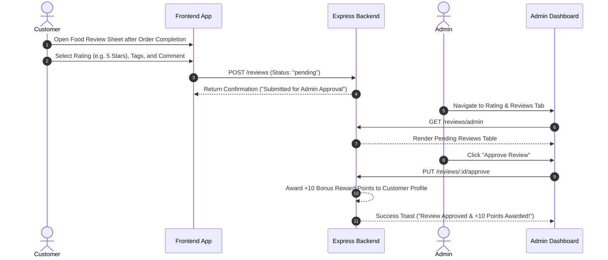

# 🧪 Backend Test Cases & Integration Workflows

This document outlines backend API testing matrix and controller interaction flows.

---

## 🔄 Review Approval & Bonus Points Workflow

---

## 🧪 Test Cases Matrix

| Test ID | Category | Target Component | Input / Trigger | Expected Outcome |
| :--- | :--- | :--- | :--- | :--- |
| **TC-BE-01** | Integration | `POST /orders` | Valid cart payload | Creates order record with `pending` status and returns HTTP 201. |
| **TC-BE-02** | Security | `PUT /reviews/:id/approve` | Unauthorized request without JWT | Returns HTTP 401 Unauthorized. |
